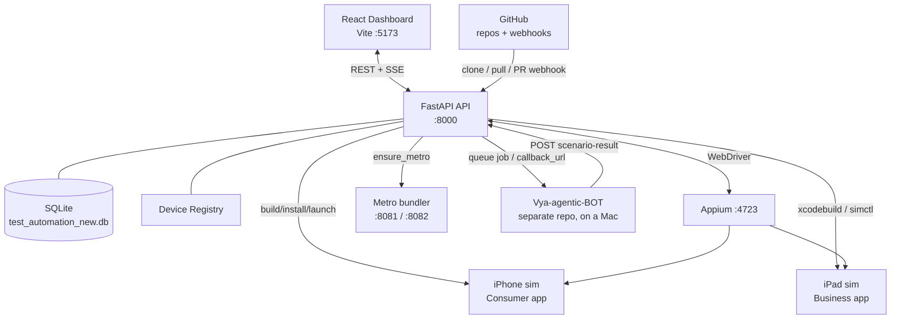

# AI-Powered Mobile Test Orchestration Platform — Architecture & Functional Document

> **What this is:** an enterprise-style platform that clones mobile app repos, builds
> them, runs UI tests on real iOS/Android simulators/devices, and layers AI on top for
> root-cause analysis, flakiness detection, impact analysis, and plain-language test
> authoring. A React dashboard drives everything; a FastAPI backend orchestrates it.
>
> **Scope of this doc:** the architecture, the code structure, the functional flows, and
> a dedicated section (§10) on *what we are currently trying to implement* — the Vya
> cross-app restaurant-suite initiative and the features built around it.

---

## 1. System Overview

The platform has four cooperating parts:

| Part | Tech | Responsibility |
|------|------|----------------|
| **Dashboard** | React 18 + Vite + TypeScript | The UI: projects, runs, scenarios, PRs, graphs, AI chat, settings. |
| **API / Orchestrator** | FastAPI (Python) | The brain: auth, project prep, builds, run orchestration, AI, device registry, webhooks. |
| **Execution layer** | Appium + `xcrun simctl` / `adb` + Metro | Actually drives simulators/devices and the app under test. |
| **External bot** | Vya-agentic-BOT (separate repo, runs on a Mac) | Runs the ~70-scenario restaurant suite and reports results back to the API. |



### Key ports
- **8000** — FastAPI API (`/api/v1/...`)
- **5173** — Vite dev server (dashboard)
- **4723** — Appium server (WebDriver)
- **8081** — Metro for the Consumer app; **8082** — Metro for the Business app
- **9000** — bot adapter (queues jobs for the external Vya bot)

---

## 2. Technology Stack

**Backend:** Python, FastAPI, SQLAlchemy, SQLite (default; `DATABASE_URL` overridable),
Appium-Python-Client, Uvicorn, JWT auth. AI via a provider abstraction (`automation/ai/`)
supporting local (Ollama) and hosted LLMs.

**Frontend:** React 18, Vite, TypeScript, React Router, Recharts (charts), D3 (dependency graph),
Monaco (code editor), `react-markdown`, `lucide-react` (icons), `date-fns`. Lint via `oxlint`.

**Execution:** `xcodebuild` + `xcrun simctl` (iOS), `adb`/Gradle (Android), CocoaPods, Metro (React Native).

---

## 3. Backend Structure (`automation/`)

| Package | Purpose |
|---------|---------|
| **api/** | FastAPI app + all v1 routers (see §5). `api/main.py` wires routers, CORS, global error handler. |
| **intelligence/** | AI/analytics engines: `scenario_runner` (NL→Appium), `flaky_detector`, `prediction`, `recommendation`, `git_analyzer`, `hybrid_impact_analyzer`, `element_catalog`/`locator_catalog`, `memory`, `cross_app_analyzer`, `chat`, `analytics`. |
| **ai/** | LLM provider abstraction (`provider`/`providers`), prompts, services (`chat`, `execution`, `generator`, `intelligence`, `knowledge`, `reporting`). |
| **appium_service/** | Appium server lifecycle: `manager`, `session_manager`, `port_manager`, `log_manager`, `config`, providers. |
| **device_manager/** | Device discovery (`discovery/ios.py`, `discovery/android.py`) + in-memory `service.py` registry. |
| **database/** | SQLAlchemy `models.py`, `config.py` (engine, `create_all`, lightweight column migration), `database.py`. |
| **projects/** | `preparation.py` (prep pipeline), `builder.py` (build/install/launch + device resolution), `repository.py` (git), `detector.py` (project type). |
| **scenarios/** | `cross_app_orchestrator.py` (iPhone+iPad at once), `cross_app_config.py` (devices/credentials), `run_full_scenario.py`, `run_vya_bot_suite.py`. |
| **android_bot/** | Suite launcher + Vya bot integration docs/adapter. |
| **streaming/** | Live screen capture during a run. |
| **integrations/** | GitHub integration (PR metadata, clone URLs). |
| **evidence/** | Evidence bundles (screenshots, logs) per run. |
| **utils/** | `validator.py` — pre-flight environment validator. |
| **agent/** | `main.py` — execution agent: discovers devices, polls jobs, heartbeats. |
| notifications/, ops/, ci_cd/, reporting/, runner/, test_runner/, plugins/ | Supporting services (alerts, ops health, CI, reporting). |

---

## 4. Data Model (SQLite, `automation/database/models.py`)

| Table | Holds |
|-------|-------|
| **users** | Accounts + JWT auth (role: admin/qa/developer/viewer). |
| **application_groups** | Logical groupings of projects. |
| **test_projects** | A repo under test: git_url, branch, platform, `app_bundle_id`, clone status. |
| **test_runs** | One execution: status, device_name, platform, timings, `bot_type`, branch, commit, `triggered_by`. |
| **scenario_results** | Per-scenario cross-app results (Consumer + Business merged, both-must-pass). |
| **saved_scenarios** | **NEW** — reusable user-built scenarios (name, project, device, ordered steps). |
| **dependency_graphs** | Cached module dependency graphs. |
| **execution_agents** | Registered runner agents. |
| **module_stability** | Per-module flakiness/stability metrics. |
| **rca_reports** | AI root-cause analysis per failed run. |
| **evidence_bundles** | Screenshots/logs per run. |
| **ai_recommendations** | AI-suggested actions. |
| **user_feedback** | Feedback loop for AI quality. |
| **project_settings** | Per-project config. |
| **audit_logs**, **system_alerts** | Ops trail + alerting. |
| **chat_sessions**, **chat_messages** | AI Chat history. |

DB URL defaults to `sqlite:///test_automation_new.db`; `Base.metadata.create_all` creates missing
tables at startup with a lightweight column-add migration for existing tables.

---

## 5. API Surface (`/api/v1`)

Auth is JWT via `get_current_user` (most routers). Webhooks are mounted **without** JWT (GitHub
calls them). Bot result callbacks need no JWT (optionally guarded by `X-Bot-Secret`).

| Router (prefix) | Notable endpoints |
|-----------------|-------------------|
| **auth** (`/auth`) | `POST /login`, `GET /me`, `POST /seed` |
| **projects** (`/projects`) | CRUD; `POST /{id}/clone`, `/pull`, `/validate`, `/prepare` (+ `/prepare/status`), `/generate-yaml` |
| **pull_requests** (`/projects`) | `GET /{id}/pulls`, `POST /{id}/pulls/{n}/test` |
| **webhooks** (`/webhooks`) | GitHub push/PR → queue a run (no JWT) |
| **jobs**/**runs** (`/jobs`,`/runs`) | `POST /poll`, `/{job}/status`, `/{job}/stream`, `/{job}/evidence`; `POST /{run}/scenario-result` (bot callback), `/{run}/trigger-android-bot`, `GET/POST /cross-app` + `/cross-app/config`, `GET /{run}/scenarios` |
| **scenario** (`/scenario`) | `POST /run`, `/run/stream` (SSE, NL steps → Appium), `capture-locators`, `generate-scripts` |
| **scenarios** (`/scenarios`) | **NEW** — saved-scenario CRUD + `GET /devices` |
| **intelligence** (`/intelligence`) | `GET /runs/{id}/rca`, `flaky/{test}`, `predict/{project}`, `memory/search`, `POST /chat`, `chat/stream`, sessions, recommendations |
| **groups** (`/groups`) | Application-group CRUD + impact scope |
| **dependency** (`/dependency`) | Module graphs, impact analysis |
| **automation** (`/automation`) | Device list/health, refresh, run/stop/status, `cancel-all-queued` |
| **analytics** (`/analytics`) | Metrics, recommendations |
| **agents** (`/agents`) | `POST /register`, `/{id}/heartbeat` (feeds the device registry) |
| **ops** (`/ops`) | `health`, `health/full`, `metrics`, `alerts`, `agents`, `audit` |

---

## 6. Core Functional Flows

### 6.1 Project preparation pipeline (`projects/preparation.py`)
Single source of truth for “make a repo runnable”, used by the agent, API, and PR runs:

```
clone/pull → checkout branch → detect type → pre-flight validate → install deps
→ build app → resolve + boot iOS device → install app → launch → ready
```
- **Pre-flight** (`utils/validator.py`) fails fast with named fixes.
- **iOS device resolution** (`builder.resolve_ios_device`) guarantees a real, local sim (prefers booted,
  matching the app’s device family when hinted); **`ensure_ios_booted`** then boots it.
- **Build** (`builder.build_ios`): pod install → `xcodebuild` for the exact sim → RN compat fixes → `.app`.

### 6.2 PR / webhook run
`POST /projects/{id}/pulls/{n}/test` (or a GitHub webhook) picks a **fresh, online** device (stale/foreign
ones expired after 90 s), resolves it to a real local iOS sim, inserts a `queued` test_run, and the
preparation pipeline runs. On failure, an **RCA report** can be generated (Analysis tab → *Trigger Analysis*).

### 6.3 Plain-language scenario run (`scenario.py` + `intelligence/scenario_runner.py`)
```
boot sim → start Metro → verify Appium reachable → open Appium session → activate app
→ ScenarioRunner.run_one(step) per step (resolve locators, tap/type/assert, screenshot)
→ SSE step results → optional generated pytest saved to e2e/
```
`ScenarioRunner` builds an **element catalog** (how it found each element + confidence) as a
locator-quality/technical-debt report.

### 6.4 Cross-app run (`scenarios/cross_app_orchestrator.py`)
Drives **two simulators at once** (Consumer=iPhone, Business=iPad) via two Appium sessions — the iOS
analogue of the Android bot’s threading model. Roles: **Consumer / Waiter / Kitchen**. Waiter+Kitchen may
share one iPad (account switch) or split across two devices. Config in `cross_app_config.py`.

### 6.5 Vya bot integration (external)
The **Vya-agentic-BOT** runs the ~70-scenario restaurant suite on a Mac. `run_vya_bot_suite.py` creates a
platform run and sets `PLATFORM_SCENARIO_CALLBACK`; the bot POSTs each result to
`/api/v1/runs/{run_id}/scenario-result`. The platform **upserts one row per (run_id, scenario_num)** and
merges the bot’s separate Consumer + Business posts into one row with the **both-must-pass** gate.
Bot-side changes: `android_bot/TANISH_BOT_PATCH.md`.

### 6.6 AI layer
RCA (LLM over failed-run logs/evidence), flaky detection, impact analysis (git diff → dependency graph),
AI Chat (memory-backed), and script generation (grounded on real captured locators).

---

## 7. Frontend Structure (`automation/dashboard/src/`)

| Route | Page | Purpose |
|-------|------|---------|
| `/` | DashboardHome | Stats, device count, **Recent Test Runs** (scrollable, sticky header), Run Cross-App Suite. |
| `/projects` | ProjectsPage | Project CRUD, clone/pull, prepare, run. |
| `/graph` | GraphPage | D3 dependency graph. |
| `/automation` | AutomationPage | Device/run control. |
| `/pull-requests` | PullRequestsPage | List PRs, queue PR runs. |
| `/scripts` | ScriptEditorPage | Monaco editor, run-on-device, AI script generation. |
| `/scenarios` | **ScenariosPage (NEW)** | Build/save/edit/delete step scenarios, pick device, live-run. |
| `/chat` | ChatPage | AI Chat. |
| `/run/:id` | RunDetails | Per-run Analysis (RCA) + Scenarios tabs, execution timeline. |
| `/settings` | SettingsPage | Config. |

**Shared components:** `ModalPortal` (portals modals to `<body>` for correct centering on tall pages),
`CrossAppRunModal`, `MonacoEditor`, `FileTree`, `BundleIdSelect`, `ScenarioPanel`, `ChatMessage`.
**API client:** `src/api.ts` — typed wrappers, `getHeaders()` (JWT), SSE readers (`runScenarioStream`, chat).

---

## 8. Device & Simulator Handling (hardening)

Guarantees iOS runs always start:
1. **Registry staleness** (`device_manager/service.py`) — devices unheard-from >90 s stop counting as
   ONLINE (`get_online_devices()`), so a dead agent’s UDID is never selected.
2. **Resolve at trigger** — PR/webhook runs store a real local sim UDID (prefer booted).
3. **Resolve + boot at prep** (`resolve_ios_device` + `ensure_ios_booted`) — invalid UDID → fallback;
   shut-down sim → auto-boot; platform-aware (consumer→iPhone, business→iPad when hinted).
4. **Scenario runs** boot the sim explicitly and verify Appium is up before connecting.

Net policy: **booted wins; if nothing is booted, boot one automatically.**

---

## 9. Deployment Reality

- Everything runs **locally on a Mac** today (sims require macOS/Xcode).
- The Render URL (`vyapy-dashboard.onrender.com`) serves **only the frontend**; the API is not hosted
  there, and the dashboard’s API base is `http://localhost:8000` (`api.ts`).
- To host: deploy the FastAPI backend publicly, make the dashboard API base an env var, switch
  SQLite → Postgres (Render disk is ephemeral). The **bot must stay on a Mac** (it needs sims).

---

## 10. What We Are Trying to Implement

### 10.1 Goal
Turn the **Vya restaurant product** (a Consumer diner app + a Business app with **Waiter** and **Kitchen**
roles) into a fully automated, **cross-app** regression suite on iOS simulators that reports into this
dashboard — so one click validates an end-to-end order lifecycle across multiple apps, accounts, and devices.

### 10.2 In progress / recently built
- **Cross-app run configuration UI** (`CrossAppRunModal` + `cross_app_config.py`): assign each role
  (Consumer / Waiter / Kitchen) to a specific simulator — both business roles on one iPad (account switch)
  or split across devices — and manage per-role **credentials** (input + saved; passwords kept local, never
  returned in clear). Backed by `GET/POST /runs/cross-app` + `/config`.
- **Saved Scenarios tab** (`ScenariosPage` + `saved_scenarios` table + `/scenarios` CRUD): a custom **step
  builder** — name a scenario, pick app + device, add/reorder/edit/delete plain-language steps, save, and
  **Run** it live (streams each step pass/fail via the existing `ScenarioRunner`).
- **Device-plumbing hardening** (§8): invalid/foreign UDID fallback, auto-boot, booted-preference, registry
  staleness — iOS runs never fail on device setup, and the simulator opens on its own.
- **Bot ⇄ platform wiring**: per-role merge of Consumer/Business posts into one both-must-pass row, and a
  suite launcher (`run_vya_bot_suite.py`) that creates a run and wires the callback for the bot’s ~70
  scenarios (`android_bot/TANISH_BOT_PATCH.md`).
- **UI polish**: portal-based modals (correct centering on tall pages), scrollable run history with sticky
  header, correct per-status badges, working spinners.

### 10.3 Known gaps / next
- **Split-device cross-app** (Waiter + Kitchen on two devices at once) is scaffolded and wired but not yet
  exercised live (Business login is account-gated).
- **Business app Metro** runs on its own port (8082); the app shows the red screen if that Metro isn’t up —
  a reload resolves it.
- **Live step runs** require **Appium running** + a built app; the scenario path now boots the sim and
  reports a clear error if Appium is down, but first-run WDA build can take ~a minute.
- **Hosting** (§9): API deploy + env-based API base + Postgres before the dashboard is useful off-Mac.

---

*Generated from the codebase state on the `feature/android-bridge-and-platform-fixes` branch.*
